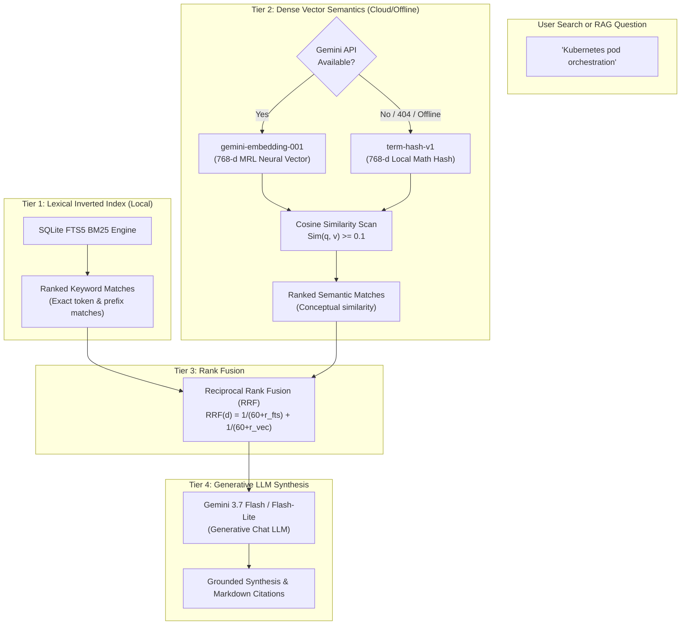

# Hybrid Search, Vector Embeddings & Offline Fallbacks

This document details the retrieval architecture of **OmniLink AI**, explaining the differences between **Generative LLMs**, **Vector Embedding Models (`gemini-embedding-001`)**, the **Local Mathematical Algorithm (`term-hash-v1`)**, and **SQLite FTS5 BM25**, as well as the resilience strategies built into the engine.

---

## 🧠 1. Model & Engine Classification: Who Does What?

OmniLink AI does not rely on a single AI model. Instead, it pairs three distinct tiers of computation:



### Classification Comparison

| Component | Category | Neural Network? | External API? | Purpose in OmniLink AI |
| :--- | :--- | :--- | :--- | :--- |
| **`gemini-3.7-flash`** | **Generative LLM** | Yes (Transformer) | Yes | Reads web pages, writes TL;DR summaries, extracts key takeaways, and synthesizes answers in *Ask Repository*. |
| **`gemini-embedding-001`** | **Embedding Model** | Yes (Encoder) | Yes | Converts text into 768-dimensional mathematical coordinates for deep conceptual similarity. |
| **`term-hash-v1`** | **Deterministic Algorithm** | **No** (Local Math) | **No** (0ms) | Generates local 768-dimensional normalized frequency vectors for offline environments and API failure recovery. |
| **`SQLite FTS5`** | **Inverted Index Engine** | **No** (BM25 Index) | **No** (Local SQLite) | Instant exact keyword, phrase, author, domain, and token prefix matching. |

---

## 🔍 2. Deep Dive: `gemini-embedding-001` vs `term-hash-v1`

### A. `gemini-embedding-001` (Neural Semantic Vector Model)
Unlike generative models that generate conversational text, `gemini-embedding-001` takes text as input and outputs a **dense list of floating-point numbers**:

$$\vec{v} = [-0.02703, 0.01870, -0.01382, \dots] \in \mathbb{R}^{768}$$

- **Semantic Understanding**: Words with different spelling but identical meaning map to adjacent points in 768-dimensional space.
  - Sentence A: *"Deploying microservices on Kubernetes cluster"*
  - Sentence B: *"Cloud-native orchestration with k8s and pods"*
  - **Shared Words**: Almost zero.
  - **Cosine Similarity**: $\cos(\theta) \approx 0.89$ (High similarity match).

- **Matryoshka Representation Learning (MRL)**:
  `gemini-embedding-001` natively supports MRL. OmniLink requests `outputDimensionality: 768`, allowing the vector database to store compact 768-float binary buffers (3,072 bytes per bookmark) rather than 3,072-float buffers, saving 75% memory with negligible loss in retrieval quality.

---

### B. `term-hash-v1` (Local Mathematical Hash Vector)
Built directly into [`server/hybridSearch.ts`](file:///Users/vivek/antigravity/OmniLink-AI---Smart-Link-Repository/server/hybridSearch.ts), `term-hash-v1` is an in-memory, deterministic algorithm:

1. **Tokenization**: Extracts lowercase alpha-numeric terms ($L > 2$ chars) from title, tags, and summary.
2. **Bit-Shift Hashing**: Computes 32-bit integer polynomial hashes for each word:
   $$\text{hash} = ((\text{hash} \ll 5) - \text{hash}) + \text{charCode}$$
3. **Dimensional Projection**: Maps hashes modulo 768 with alternating signs to avoid collision bias.
4. **Euclidean Normalization**: Scales the vector to unit length ($\|\vec{v}\|_2 = 1.0$) so that dot products compute exact cosine similarities:
   $$\hat{v} = \frac{\vec{v}}{\sqrt{\sum_{i=1}^{768} v_i^2}}$$

#### Why It Exists
- **Zero Latency**: Executes in microseconds on local CPU.
- **100% Offline**: Works on airplanes, isolated NAS networks, or air-gapped environments.
- **Zero Cost & No Quotas**: Never throttles or incurs cloud charges.
- **Fault-Tolerant Fallback**: If an API key is missing, network drops, or Google deprecates a model name, the application continues indexing and searching seamlessly.

---

## ⚖️ 3. Reciprocal Rank Fusion (RRF)

Neither pure keyword search nor pure vector search is sufficient on its own:
- **Pure Lexical Search (BM25)** fails when users query synonyms or high-level concepts not explicitly written in the bookmark text.
- **Pure Vector Search** can suffer from "semantic drift" or false positives when looking for specific error codes, author names, or programming languages.

OmniLink merges the ranked candidate lists using **Reciprocal Rank Fusion** with constant $K = 60$:

$$\text{RRF}(d) = \left(\frac{1}{60 + \text{rank}_{\text{FTS}}(d)}\right) + \left(\frac{1}{60 + \text{rank}_{\text{Vector}}(d)}\right)$$

- If an item matches **both** exact keywords and deep semantic embeddings, it receives a score $> 0.032$ and ranks at the very top.
- If an item matches **only** semantically or **only** lexically, it remains in the candidate pool without completely crowding out exact matches.

---

## 🛡️ 4. Resilience & Future-Proofing

### 1. Dimension Invariance (768-d)
OmniLink standardizes all vector storage on **768 dimensions**. Regardless of whether vectors come from `gemini-embedding-001`, future Google models, or `term-hash-v1`, the SQLite `BLOB` column and cosine similarity math remain 100% compatible without database migrations.

### 2. Versioned Model Tagging in SQLite
The `embeddings` table records the originating model:
```sql
SELECT link_id, model, dimensions, updated_at FROM embeddings;
```
- Rows indexed with `gemini-embedding-001` are marked as neural vectors.
- Rows indexed with `term-hash-v1` are marked as offline fallbacks.
- When background indexing runs with an active API connection, offline `term-hash-v1` vectors are automatically upgraded to neural embeddings in the background.

### 3. Graceful Degradation Strategy
If Google changes or deprecates an embedding model in the future:
1. The API failure is caught in `try/catch` without crashing server threads.
2. The indexer falls back to `term-hash-v1`.
3. Lexical search (`links_fts`) continues operating with 100% availability.
4. Once the model name configuration is updated, the background indexer refreshes all bookmark embeddings automatically.
